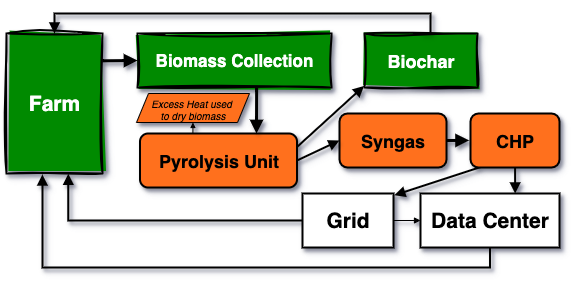
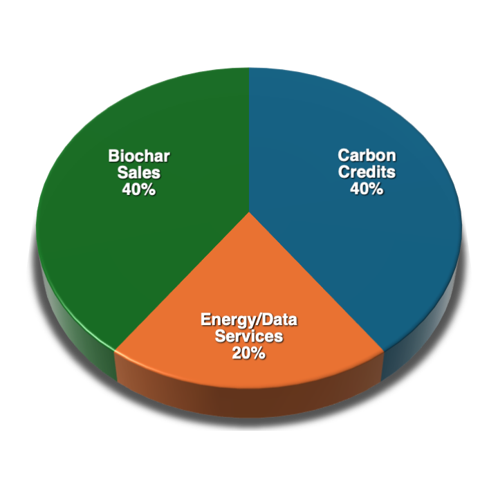

# Symbiotic Grid: The Agri-Compute Nexus

### An Official Blueprint Repository of the Unified Conscious Evolution Framework (UCF)

This project serves as a **Blueprint Repository** within the [Unified Conscious Evolution Framework (UCF)](https://github.com/dj-ccs/Unified-Conscious-Evolution-Framework). Its purpose is to provide a complete, open-source, and implementation-ready plan for physical, regenerative infrastructure.

Symbiotic Grid is the "hardware" that generates the real-world outcomes our software labs are designed to measure and value:
*   The **verifiable ecosystem health data** (biochar carbon sequestration, improved soil health) produced by this system is designed to be valued by the **[EHDC (Pillar IV) Lab](https://github.com/dj-ccs/EHDC)**.
*   The **research, data, and operational findings** from this model are designed to be published and peer-reviewed on the **[Open Science DLT (Pillar I) Lab](https://github.com/dj-ccs/open-science-dlt)**.

---

## Project Overview

**Symbiotic Grid** is an open-source research repository documenting the **Agri-Compute Nexus**—a revolutionary model for building sustainable data centers powered by agricultural waste through pyrolysis. This is not a software project, but rather a comprehensive knowledge base and whitepaper establishing public prior art to prevent proprietary enclosure of this circular economy model.

## Core Innovation: The Symbiotic Cycle

The model is a three-step, closed-loop symbiotic cycle:

1.  **Input:** Agricultural residues (e.g., corn stover, rice straw, industrial hemp) are sourced from local farmers, turning a waste liability into a revenue stream.
2.  **Process:** On-site pyrolysis converts this biomass into two valuable outputs: syngas and biochar.
3.  **Output:**
    *   The **syngas** provides clean, baseload power for modular, on-site data centers.
    *   The **biochar**, a stable form of sequestered carbon, is returned to farmers to dramatically improve soil health, water retention, and crop yields.

### Key Metrics (Based on Riverina Case Study)

| Metric                    | Value                               | Source Document                  |
| :------------------------ | :---------------------------------- | :------------------------------- |
| **Annual Revenue**        | **$32.75M - $38.75M**               | `appendix_c_economic.csv`        |
| **Capital Investment**    | **~$23M**                           | `appendix_c_economic.csv`        |
| **Payback Period**        | **3-7 Years**                       | `whitepaper/Symbiotic-Grid_v09.pdf` |
| **Internal Rate of Return (IRR)** | **10%+ Target**             | `white-paper/Symbiotic-Grid_v09.pdf` |
| **Annual Carbon Sequestration** | **~15,000 tonnes (Biochar)**  | `appendix_a_technical.csv`       |
| **Energy Generation**     | **0.8 - 1.5 MWh per tonne biomass** | `appendix_a_technical.csv`       |

## Key Components

This repository contains all the necessary components to understand, evaluate, and implement a Symbiotic Grid facility.

*   **[Whitepaper](./whitepaper/Symbiotic-Grid_v09.pdf):** A 21-page comprehensive document covering the complete technical specifications, economic modeling, a real-world case study (Riverina, Australia), and multi-jurisdictional regulatory pathways.
*   **[Data Appendices](./data/):** Machine-readable CSV files detailing the technical, economic, regional, and regulatory data underpinning the model.
*   **[Diagrams](./diagrams/):** High-resolution system architecture and revenue stack visualizations.

## The Symbiotic Revenue Stack

The economic model is designed for resilience through four diversified, synergistic income streams, making it robust against market fluctuations in any single sector.

1.  **Biochar Carbon Credits:** Monetizing the carbon sequestered in biochar.
2.  **Biochar Agricultural Sales:** Selling high-quality biochar back to the agricultural community.
3.  **Electricity Sales:** Selling excess baseload power generated from syngas to the grid or local users.
4.  **Data Center Services:** Providing sustainable, low-cost colocation or compute services.

## Public Prior Art Strategy

By publishing these comprehensive technical and economic details under a **Creative Commons CC BY 4.0 License**, we are establishing public prior art. This strategy is designed to prevent the proprietary enclosure of this symbiotic model, ensuring it remains an open-source blueprint that can be freely adapted, implemented, and improved upon by communities worldwide.

## Integration with the UCF Ecosystem

This blueprint is a cornerstone of the Unified Conscious Evolution Framework's vision to connect digital value systems with tangible, real-world regeneration. A community that implements a Symbiotic Grid can:

*   Use **QSAAT technology** (from the EHDC Lab) to measure the soil health improvements from its biochar.
*   Translate those measurements into **EHDC tokens**, creating a direct economic reward for their sequestration efforts.
*   Use the **Open Science DLT** platform to publish their operational data and contribute to the global knowledge commons on pyrolysis and regenerative agriculture.

This repository provides the physical plan; the other UCF labs provide the digital tools to measure, value, and share the impact.

## Pathways for Engagement

This repository is a tool. Here’s how different partners can use it to get started:

*   **For Farmers & Agricultural Co-ops:**
    Start with the **[Riverina Case Study](./whitepaper/Symbiotic-Grid_v09.pdf)** (Section 4) and the biochar data in **[`appendix_a_technical.csv`](./data/appendix_a_technical.csv)**. Understand the direct benefits to soil health and the potential new revenue stream from your agricultural residue.

*   **For Energy Developers & Data Center Operators:**
    Focus on the **pyrolysis technical specifications** (Section 3 of the whitepaper) and the energy yield data in **[`appendix_a_technical.csv`](./data/appendix_a_technical.csv)**. The economic model in **[`appendix_c_economic.csv`](./data/appendix_c_economic.csv)** details the business case for co-locating compute infrastructure with baseload renewable energy.

*   **For Climate Tech Investors & Funds:**
    The **[Symbiotic Revenue Stack](./diagrams/revenue_stack.png)** and the full financial model in **[`appendix_c_economic.csv`](./data/appendix_c_economic.csv)** are your starting points. The 3-7 year payback period and diversified revenue streams demonstrate a de-risked and scalable investment thesis.

*   **For Policymakers & Regulators:**
    Review the **[multi-jurisdictional compliance pathways](./data/appendix_d_regulatory.csv)** and the whitepaper's discussion on integrating with carbon credit markets (Section 5). This blueprint provides a shovel-ready model for rural economic development and climate mitigation.

## Join the Development of This Blueprint

This is a living document, not a static report. We invite collaborators to help adapt, refine, and implement this model globally. The "development" of this project happens through discussion and adaptation.

**The best way to contribute is through [GitHub Issues](https://github.com/dj-ccs/symbiotic-grid/issues).**

*   **Have a technical question?** Open an issue with the `[Technical Question]` tag.
*   **Want to adapt this model for your region?** Open an issue with the `[New Case Study]` tag and let's discuss the data.
*   **Have updated economic data?** Open an issue with the `[Economic Model]` tag.
*   **Found a new regulatory pathway?** Open an issue with the `[Policy]` tag.

By using Issues as our forum, we can build a transparent, open-source knowledge base of adaptations and improvements for the benefit of all.

## License

This work is licensed under a **[Creative Commons Attribution 4.0 International License](./LICENSE)**. You are free to share and adapt this material for any purpose, even commercially, as long as you give appropriate credit.
